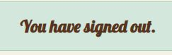
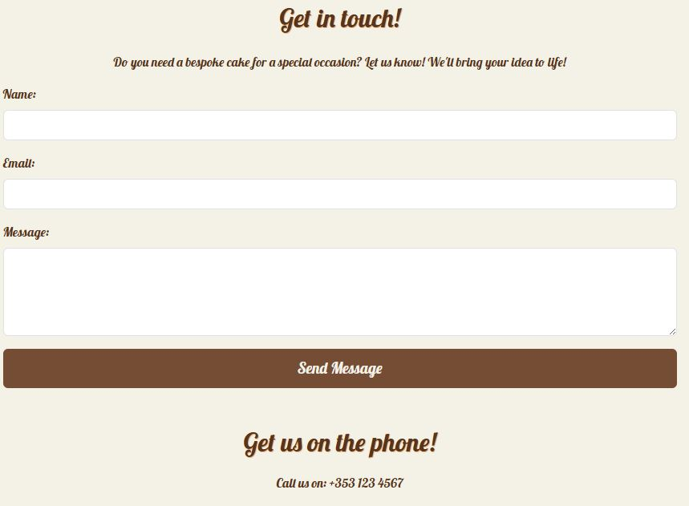
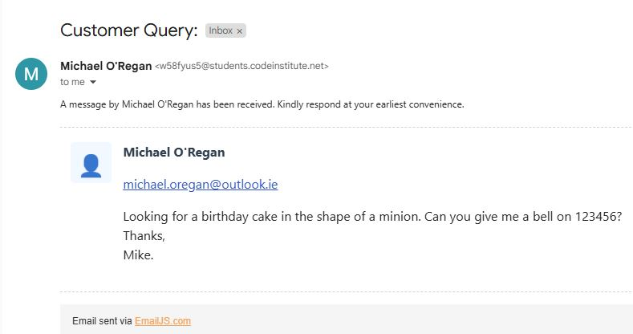
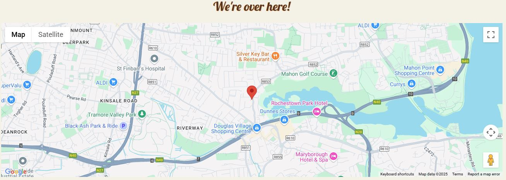
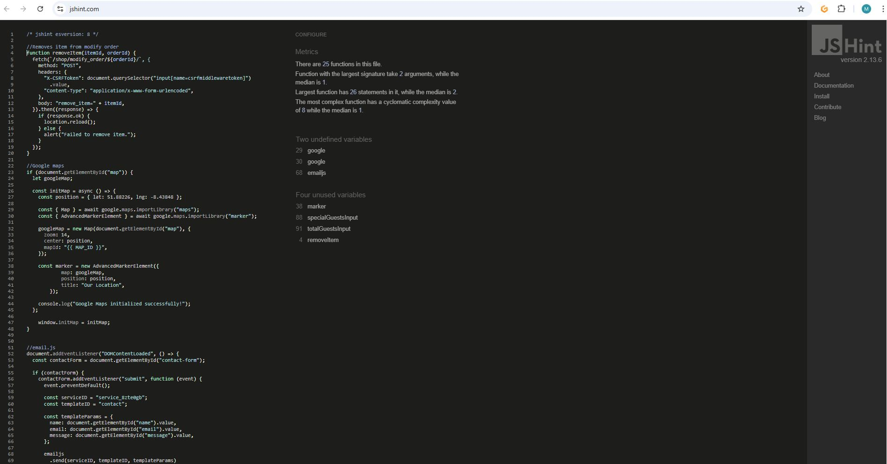

# The Baker's Cottage ReadMe Document

Welcome, all!  

This document aims to explain the who, what, why, and how of the Baker's Cottage website.

[The Baker's Cottage Website](https://the-bakers-cottage-987e29b429de.herokuapp.com/)

## The Baker's Cottage

The Baker's Cottage is an cake store that allows users to buy selection boxes and ready-made cakes online for in-store collection.  Customers need to create an accouunt in order to do this, however.  But once logged in, customers can order cakes, modify that order, or even delete that order.  They can also leave reviews, which will be shown on the home page of the website.  
 
The site also offers customers to book afternoon tea.  This section does not require an account.  Guests can book one of the 3 packages just as well as registered users.  There is an input field for the number of guests with dietary needs, which can be specified in the text box at the bottom of the form.  Users can also specify an event here e.g. birthday, retirement etc.
 
Customers can also get in contact with the bakery via the message section of the contact page.  This section employs EmailJS, where users can send messages directly to the bakery's email address detailing their needs e.g. birthday cake, wedding cake etc.
 
The site was built using the Djando framework and includes Bootstrap's CSS/JS abilities also.  
 
As a user, I can create an account, log in and order cakes online for in-store collection so that I can enjoy delicious artisan cakes with my friends and family.  I can also book afternoon tea online as a guest or registered user so that I can share quality time with friends and family in confortable surroundings, while indulging in incredible cakes with tea/coffee/procecco.  Finally, I can get in contact with the bakery so that I can arrange a bespoke cake with them or send general queries.

## Initial Design
The original idea was to have 4 pages - Home, Shop, Afternoon Tea, Contact.  Each page would follow the same basic format, but have it's own layout depending on the needs of the user.  This was easily applied through the Django framework.  I created the overall in Django project and then added 4 apps for Home, Shop, Afternoon Tea, Contact.

### Home Page
This shows the user a collection of images of cakes that the bakery has created.  It is meant to draw the user in with eye catching designs that show off the bakery's ability.  Further down, the user gets a brief description of the specialities provides by the bakery, along with a section for customer reviews below that:

### Shop Page
This shows the user a collection of cards detailing what is on offer over 2 sections.  The first section will display 4 selection box offerings where customers can place an order for a randomised set of cakes in various box sizes - from 6 to 12 slices.
The second section will display individual cakes that a user can order online for in store collection.  Users will be able to add to the cart, but will not be allowed to submit an order unless they are registered.  The reason for this is that I believed it's more controllable for the bakery to keep orders organised and attached to customers who they can contact if an order is not collected:

### Afternoon Tea Page
This shows the user a collection of cards detailing 3 afternoon tea packages on offer.  Users can then scroll down to the booking form and proceed to book.  Guests and registered users alike can book.  The form allows for dietary needs or special events to be detailed in the text box:

### Contact Page
This is where the user can see where the bakery is based, with the use of google maps, and the user can contact the bakery through the messaging service or phone number provided:

## General Features

### Responsive Design
The website was designed to ensure that the user can enjoy all the features of this website on all devices - Mobile, Tablet, PC.
#### Mobile Device

#### Tablet Device

#### Desktop Device

### CRUD Functionality
In the shop, users can add to cart, submit that order, modify the order, and delete the order.  This is reflected in the database and viewable on the admin screen.
#### Cart Modal (Create/Delete)

#### Order History (Update/Delete)

#### Admin Review (Logged to Database)

### User Reviews
Users can leave reviews on the home page through a modal.  This is then displayed in the review section but also stored in the database.  Only registered users can leave reviews as I believe it was better for tracking and would reduce malicious reviews.
#### Review Modal

#### User Reviews

#### User Reviews

### Sign in / Sign Up / Log Out
Users can create accounts, sign in to order cakes and leave reviews, and log out with ease.
#### Register

#### Sign In

#### Log Out

### Book Afternoon Tea
Users and guests alike can book an afternoon tea slot.  Users can specify dietary needs and the number of people with dietary needs.  They can also specify if the booking is for a special event in the text box.  Validation has been added, whereby guests with dietary needs cannot exceed total guests.  Also, guests with dietary needs is not required to complete the booking.  The other fields are required for the booking to go through.  
 
In the future, I would like to add functionality for modfying or deleting a booking, but it wasn't part of the initial build and was all time dependent.

#### Tea Packages

#### Booking Form

#### Admin Bookings

### Contact Page
The contact page contains a messaging service that employs EmailJS to send messages from the user to an email address of choice (In my case, my CI email address).  These messages can be anything, from general queries to requests for a bespoke cake.
 
The page also contains a map, which uses a Google Maps API to display the location of the bakery (I used Soma Cafe in Cork - Great if you're ever in the area).

#### Messages

#### Email Received

#### Map

## Models
3 models were built in this project.  They were created in the Home, Bookings and Shop apps.

### Review Model
This model stores user reviews, which links each review to a registered user via a foreign key relationship.  It includes a text based field and rating field.  Each review stores its creation timestamp.  If a user is deleted, so too are their reviews through the enforcement of deletion rules.  A user can create numerous reviews, but the review is owned by only one user.

### Bookings Model
This schema was designed to manage the tea packages and customer bookings efficiently.  In the tea package, there are various attributes e.g. name, price, number of tiers, and an optional prosecco inclusion.  The schema supports indexed fields, foreign key relationship and validation rules.  

 

The user to booking is a one-to-many relationship:  
- Each booking is linked to a registered user via a foreign key
- Each user can have multiple bookings, but each booking belongs to one user
- Unregistered customers have their name and email stored instead

 

The booking to tea package is a many-to-one relationship:
- Each booking is associated with one tea package through the use of a foreign key
- Users choose a tea package when making a reservation

### Shop Model
This is the mot comprehensive of the models and manages selection boxes, individual cakes, order, and order items.  The selection boxes and cakes use attributes such as name, price and category.  The Order model enables users to place orders and tracks user details, total price, pickup time, items and status.  The OrderItem model links individual items to Orders.  The schema allows for optimised queries, structured data relationships and validation.

 

The User to Order is a one-to-many relationship linked via a foreign key:
- Each user can place multiple orders, but each order belongs to one user

 

The Order to OrderItem is also a one-to-many relationship linked via a foreign key:
- Each order can contain various items

 

The OrderItem to Cake/Selection Box is a many-to-one relationship and is linked to an item type and item id
- Each OrderItem is an individual item in an order
- The item type determines a cake or selection box
- The item id stores the id of the selected item

## Testing
### Code Validation
All 3 files were put through their respective validator tools:

#### HTML - Warnings due to Django tags
I was unable to perform thorough validation checks using the W3C validator as all of the Django tags were highlighting errors.  That said, there were no other errors in relation to the other HTML elements.

#### CSS - No errors

#### JSHint - No errors
There were 2 undefined variables and 4 unused variables, which were not a priority fix due to time constraints.

#### CI Python Linter - No errors
All code passed the Code Institute's Python Linter.  I did not take screenshots as there were too many due to the size of the project, but each app was reviewed for the python files.

### Functional Testing
<table>
    <tr>
        <th>Action</th>
        <th>Expected Behaviour</th>
        <th>Pass/Fail</th>
    </tr>
    <tr>
        <td>Page URL</td>
        <td>Deployed page to open</td>
        <td>Pass</td>
    </tr>
    <tr>
        <td>Page Responsiveness</td>
        <td>Pages are responsive to mobile, tablet and desktop users</td>
        <td>Pass</td>
    </tr>
    <tr>
        <td>External Links</td>
        <td>External website links work and open in new page</td>
        <td>Pass</td>
    </tr>
    <tr>
        <td>Relative Filepaths</td>
        <td>All relative filepaths function correctly to display correct content</td>
        <td>Pass</td>
    </tr>
    <tr>
        <td>Reviews</td>
        <td>Reviews are submitted by registered users and stored in the database.  Validation protects the database integrity</td>
        <td>Pass</td>
    </tr>
    <tr>
        <td>Shop</td>
        <td>Registered users have full CRUD functionality on their orders and validation protects the database integrity</td>
        <td>Pass</td>
    </tr>
    <tr>
        <td>Orders</td>
        <td>Orders are stored in the database and validation protects the database integrity</td>
        <td>Pass</td>
    </tr>
    <tr>
        <td>Bookings</td>
        <td>Users and guests can book afternoon tea and validation maintains database integrity</td>
        <td>Pass</td>
    </tr>
    <tr>
        <td>Email</td>
        <td>Messages trigger an email via emailJS and deliver the message to the admin's provider of choice</td>
        <td>Pass</td>
    </tr>
    <tr>
        <td>Google Maps</td>
        <td>Maps is present and full interactive</td>
        <td>Pass</td>
    </tr>
    <tr>
        <td>Physical Test</td>
        <td>Website tested on users and their various devices</td>
        <td>Pass</td>
    </tr>
</table>

### Browser Performance
The game performed well on the below browsers:
<ul>
    <li>Google Chrome</li>
    <li>Microsoft Edge</li>
    <li>Mozilla Firefox</li>    
    <li>Safari</li>
</ul>

### Lighthouse Checks

#### Lighthouse Desktop Check

#### Lighthouse Mobile Check

### Bug Fixes
Bugs that were discovered and fixed are as follows:
<ul>
    <li>Missing semicolons (JS)</li>
    This was fixed by including semicolons to the end of the JS code.
</ul>

## Known Bugs
Bugs that remain due to time contraints are as follows:
<ul>
    <li></li>
</ul>

<ul>
    <li></li>
</ul>

## Deployment
The site was deployed through GitHub.  The steps taken were:
<ul>
    <li>Go to settings</li>
    <li>Select pages and apply "Deploy from branch" on the Source dropdown</li>
    <li>Our branch is set to "main" with "/root" as the folder</li>
</ul>

## Credits
### The following websites were used for informational purposes:

[Stack Overflow - General Queries](https://stackoverflow.com/)

[W3 Schools - General Queries](https://www.w3schools.com/)

[MDN Web Docs - General Queries](https://developer.mozilla.org/en-US/)

Code Institute - JavaScript Essentials Module

### The following websites were used visual purposes:

[Google Fonts](https://fonts.google.com/)

[Favicon](https://favicon.io/)

### The following projects were referenced in relation to HTML, CSS & JavaScript:

[Love Running Essentials Project](https://github.com/Code-Institute-Solutions/love-running-v3/tree/main/)

[Love Maths Essentials Project](https://github.com/Code-Institute-Solutions/love-maths-2.0-sourcecode/tree/master/)

[CPS - Project 1](https://github.com/Mickyreegs/CPS)
