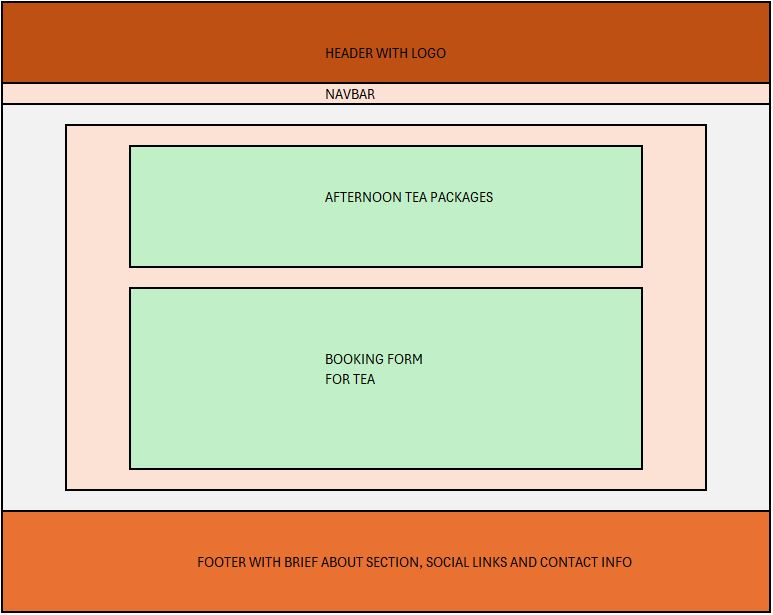

# The Baker's Cottage ReadMe Document

Welcome, all!  

This document aims to explain the who, what, why, and how of the Baker's Cottage website.

[The Baker's Cottage Website](https://the-bakers-cottage-987e29b429de.herokuapp.com/)

## The Baker's Cottage

The Baker's Cottage is an cake store that allows users to buy selection boxes and ready-made cakes online for in-store collection.  Customers need to create an accouunt in order to do this, however.  But once logged in, customers can order cakes, modify that order, or even delete that order.  They can also leave reviews, which will be shown on the home page of the website.  
 
The site also offers customers to book afternoon tea.  This section does not require an account.  Guests can book one of the 3 packages just as well as registered users.  There is an input field for the number of guests with dietary needs, which can be specified in the text box at the bottom of the form.  Users can also specify an event here e.g. birthday, retirement etc.
 
Customers can also get in contact with the bakery via the message section of the contact page.  This section employs EmailJS, where users can send messages directly to the bakery's email address detailing their needs e.g. birthday cake, wedding cake etc.
 
The site was built using the Djando framework and includes Bootstrap's CSS/JS abilities also.  
 
As a user, I can create an account, log in and order cakes online for in-store collection so that I can enjoy delicious artisan cakes with my friends and family.  I can also book afternoon tea online as a guest or registered user so that I can share quality time with friends and family in confortable surroundings, while indulging in incredible cakes with tea/coffee/procecco.  Finally, I can get in contact with the bakery so that I can arrange a bespoke cake with them or send general queries.

## Initial Design
The original idea was to have 4 pages - Home, Shop, Afternoon Tea, Contact.  Each page would follow the same basic format, but have it's own layout depending on the needs of the user.

### Home Page
This shows the user a collection of images of cakes that the bakery has created.  It is meant to draw the user in with eye catching designs that show off the bakery's ability.  Further down, the user gets a brief description of the specialities provides by the bakery, along with a section for customer reviews below that:

### Shop Page
This shows the user a collection of cards detailing what is on offer over 2 sections.  The first section will display 4 selection box offerings where customers can place an order for a randomised set of cakes in various box sizes - from 6 to 12 slices.
The second section will display individual cakes that a user can order online for in store collection.  Users will be able to add to the cart, but will not be allowed to submit an order unless they are registered.  The reason for this is that I believed it's more controllable for the bakery to keep orders organised and attached to customers who they can contact if an order is not collected:

### Afternoon Tea Page
This shows the user a collection of cards detailing 3 afternoon tea packages on offer.  Users can then scroll down to the booking form and proceed to book.  Guests and registered users alike can book.  The form allows for dietary needs or special events to be detailed in the text box:

### Contact Page
This is where the user can see where the bakery is based, with the use of google maps, and the user can contact the bakery through the messaging service or phone number provided:

## General Features

### Responsive Design
The website was designed to ensure that the user can enjoy playing this game on all screen sizes.

### Simulated Stock Prices
PortfoliOWN randomises the daily stock prices using a range of +/-2% day-on-day. 

### Daily Valuations
The stocks in your portfolio are valued each day, the same as in real life.  This gives the user an idea of the unrealised gains/losses on their stock selections.

### Links to External Websites
There are links to Yahoo and Bloomberg for stock quotes and also to Investopedia to learn about investments and the stock market.

## Testing
### Code Validation
All 3 files were put through their respective validator tools:

#### HTML - No errors or warnings

#### CSS - No errors, 1 warning
There was one warning - "Imported style sheets are not checked in direct input and file upload modes".  This was my import from Google Fonts and is an expected warning.

#### JSHint
There were 2 warnings related to functions in loops but these were highlighted by Code Institute as a non-error during the course.  Due to time constraints, these were left as is.
 
There was 1 unused variable in the JS code related to the handleCheckBoxChange.  This is being called during the creation of the HMTL checkbox in UpdateMyHoldingsUI.

### Functional Testing
<table>
    <tr>
        <th>Action</th>
        <th>Expected Behaviour</th>
        <th>Pass/Fail</th>
    </tr>
    <tr>
        <td>Page URL</td>
        <td>Deployed page to open</td>
        <td>Pass</td>
    </tr>
    <tr>
        <td>Page Responsiveness</td>
        <td>Pages are responsive to mobile, tablet and desktop users</td>
        <td>Pass</td>
    </tr>
    <tr>
        <td>External Links</td>
        <td>External website links work and open in new page</td>
        <td>Pass</td>
    </tr>
    <tr>
        <td>Relative Filepaths</td>
        <td>All relative filepaths function correctly to display correct content</td>
        <td>Pass</td>
    </tr>
    <tr>
        <td>Daily Price Simulation</td>
        <td>All prices are updating to within +/-2% and displaying correctly</td>
        <td>Pass</td>
    </tr>
    <tr>
        <td>Stock Dropdown</td>
        <td>All stocks have been pushed to the dropdown select list from JS</td>
        <td>Pass</td>
    </tr>
    <tr>
        <td>Selected Stock For Purchase</td>
        <td>The selected stock is pushed to the Portfolio table in Portfolio Valuation</td>
        <td>Pass</td>
    </tr>
    <tr>
        <td>Game Calculations</td>
        <td>All calculations - Cost, Proceeds, Unrealised gain/loss, Profit, Cash On Hand - Calculate as expected</td>
        <td>Pass</td>
    </tr>
    <tr>
        <td>Physical Test</td>
        <td>Website tested on users and their various devices</td>
        <td>Pass</td>
    </tr>
</table>

### Browser Performance
The game performed well on the below browsers:
<ul>
    <li>Google Chrome</li>
    <li>Microsoft Edge</li>
    <li>Mozilla Firefox</li>    
    <li>Safari</li>
</ul>

### Lighthouse Checks

#### Lighthouse Desktop Check

#### Lighthouse Mobile Check

### Bug Fixes
Bugs that were discovered and fixed are as follows:
<ul>
    <li>Missing semicolons (JS)</li>
    This was fixed by including semicolons to the end of the JS code.
    <li>Stray Start Tag (HTML)</li>
    This was fixed by removing the header.
    <li>Users able to buy stocks even when cash was depleted(JS)</li>
    This was fixed by including the resetBuySection() to "function adjustPortfolio(stock)" & "function updateCashUI(stock)" code.
    <li>JSHint - "The body of a for in should be wrapped in an if statement to filter unwanted properties from the prototype."</li>
    This was fixed by adding if statements where necessary to the For...In
</ul>

## Known Bugs
Bugs that remain due to time contraints are as follows:
<ul>
    <li>Selling lots with both gains and losses included (JS)</li>
    The sum of the Gain/Loss should be colour coded by green (Profit) or red (Loss).
    If the last lot selected in a group for sale is red, but the proceeds indicate a profit, this will show red and vice versa:
</ul>

<ul>
    <li>Selecting a stock for sale, deselecting it, then reselecting it for sale (JS)</li>
    The profit/loss is calculated upon selection of a stock for sale from the portfolio.  Originally, if this was deselected, the profit/loss remained.  If the stock was  reselected, the profit/loss figure increased each time.  This was fixed by adding an "else if" to the if statements of currentCheckbox.checked.  The only issue now is that if you select more than 1 row, and only deselect 1, the proceeds and profit reset to 0 even if there are still stocks selected.  This, however, does not actually affect the cash proceeds in the game.  Once the stock is sold, the correct monetary value of that stock, inclusive of actual P&L, is added back to cash on hand. 
</ul>

### Upon selection - Works correctly:

### Upon deselection & subsequent reselection - Adds to the prior selected balance:

## Deployment
The site was deployed through GitHub.  The steps taken were:
<ul>
    <li>Go to settings</li>
    <li>Select pages and apply "Deploy from branch" on the Source dropdown</li>
    <li>Our branch is set to "main" with "/root" as the folder</li>
</ul>

## Credits
### The following websites were used for informational purposes:

[Stack Overflow - General Queries](https://stackoverflow.com/)

[W3 Schools - General Queries](https://www.w3schools.com/)

[MDN Web Docs - General Queries](https://developer.mozilla.org/en-US/)

Code Institute - JavaScript Essentials Module

### The following websites were used visual purposes:

[Google Fonts](https://fonts.google.com/)

[Favicon](https://favicon.io/)

### The following projects were referenced in relation to HTML, CSS & JavaScript:

[Love Running Essentials Project](https://github.com/Code-Institute-Solutions/love-running-v3/tree/main/)

[Love Maths Essentials Project](https://github.com/Code-Institute-Solutions/love-maths-2.0-sourcecode/tree/master/)

[CPS - Project 1](https://github.com/Mickyreegs/CPS)
